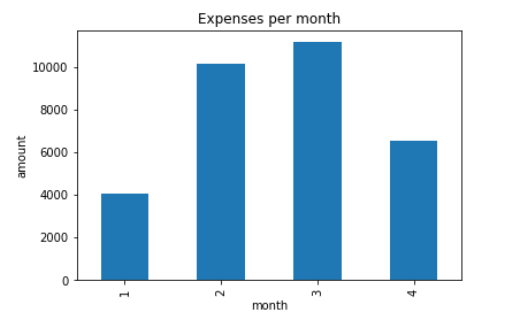

### BUDGET ANALYSIS

#### INCOME ANALYSIS

**Projected Yearly Income** = $6085

#### EXPENSES PER CATEGORY
**Category**    |      **Amount**
----------------|:---------------
Food and Drink  |       3317.19
Payment         |       6310.50
Recreation      |       235.5
Shops           |       1500.0
Transfer        |       20537.34
Travel          |       35.19
---------------------------------

Total expenses were $31,935.72 out of which 64.3% is for the Transfers and lowest expenses are for Travel 0.1% 

#### NUMBER OF TRANSACTIONS PER MONTH

![Transaction_per_category][Images/Transaction_per_category.PNG)

Food & Drinks have the highest number of transactions - 15 while Recreations & Shops have the lowest number of transactions - 3 each

#### EXPENSES PER MONTH

**Date**        |      **Amount**
----------------|:---------------
2020-01-31      |     4084.83
2020-02-29      |    10145.24
2020-03-31      |      11145.24
2020=04-30      |    6560.41

Highest expenses are accounted in the month of March, while the lowest expenses are for January

