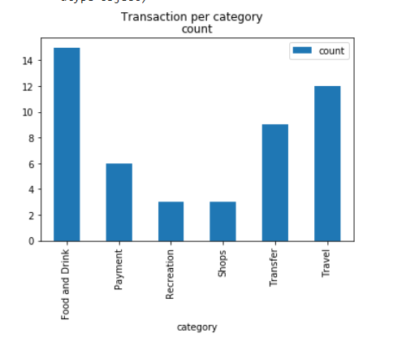
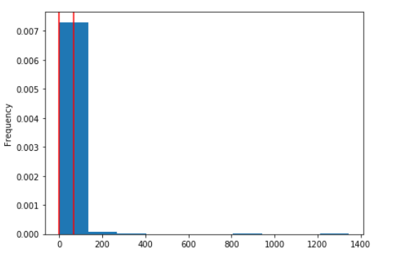

### BUDGET ANALYSIS

#### INCOME ANALYSIS


**Projected Yearly Income** = $6085

#### EXPENSES PER CATEGORY
**Category**    |      **Amount**
----------------|:---------------
Food and Drink  |       3317.19
Payment         |       6310.50
Recreation      |       235.5
Shops           |       1500.0
Transfer        |       20537.34
Travel          |       35.19
---------------------------------


Total expenses were $31,935.72 out of which 64.3% is for the Transfers and lowest expenses are for Travel 0.1% 

#### NUMBER OF TRANSACTIONS PER CATEGORY



Food & Drinks have the highest number of transactions - 15 while Recreations & Shops have the lowest number of transactions - 3 each

#### EXPENSES PER MONTH

**Date**        |      **Amount**
----------------|:---------------
2020-01-31      |     4084.83
2020-02-29      |    10145.24
2020-03-31      |      11145.24
2020=04-30      |    6560.41


Highest expenses are accounted in the month of March, while the lowest expenses are for January

### RETIREMENT PLANNING

Use of IEX API (sandbox transactions) to fetch historical closing prices for a retirement portfolio and then run Monte Carlo simulations to project the portfolio performance at 30 years. 

#### Monte Carlo Simulation

1.Use the IEX API to fetch historical closing prices for a traditional 60/40 portfolio using the SPY and AGG tickers to represent the 60% stocks (SPY) and 40% bonds (AGG)

##### Closing Price

**Stock**       | **Closing Price**
----------------|:---------------
SPY             |     295.29 
AGG             |     122.97

##### Average Daily Retruns

**Stock**       | **Avg daily returns**
----------------|:---------------
SPY             |       0.000279
AGG             |       0.000535

##### Volatility (Standard Deviation)

**Stock**       | **Std Dev**
----------------|:---------------
SPY             |   0.028366
AGG             |   0.019408


Visualization of Monte Carlo Simulation of 500 runs and 30 years for the 60/40 portfolio and plot the results.


*90% Confidence Interval from the Monte Carlo Simulation*

Using the ending cumulative returns, plot a histogram of the results and plot the 90% confidence interval as vertical lines on the histogram.



**Retirement Analysis**

What are the expected cumulative returns at 30 years for the 10th, 50th, and 90th percentiles?

*Expected Cumulative Returns at 30 years*
*Percentile*    | *Cum returns*
----------------|:---------------
10th percentile |   0.72
50th percentile |   5.56  
90th percentile |   39.22


Given an initial investment of $20,000, what is the expected return in dollars at the 10th, 50th, and 90th percentiles?

*Expected Portfolio Returns at 30 years*

*Percentile*    | *Portfolio returns*
----------------|:---------------
10th percentile |   $14400.0
50th percentile |   $111200.0
90th percentile |   $784400.0


Given the current projected annual income from the Plaid analysis, will a 4% withdrawal rate meet or exceed that value at the 10th percentile? Note: This is basically determining if retirement income is equivalent to current income.
```
The current projected annual income is 6085$, 4% withdraw rate from the retirement portfolio is 576$ doesn't meet the value at the 10th percentile
```
How would a 50% increase in the initial investment amount affect the 4% retirement withdrawal? In other words, what happens if the initial investment had been bigger?
```
4% withdrawal rate from the retirement portfolio 865.28 will not meet the value of projected income
```

(Optional Challenge) Use the Monte Carlo data and calculate the cumulative returns at the 5%, 50%, and 95% quartiles and plot this data as a line chart to see how the cumulative returns change over the life of the investment.


